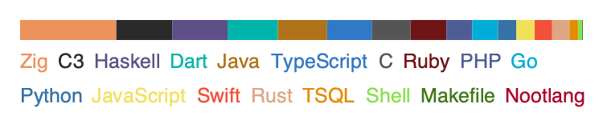

# Advent Of Code 2022

This year for Advent of Code, I will randomly pick another language each day to
solve the puzzles. This is a combination of languages I know and languages I'd
like to learn (Crystal and C3). As the days progressed, I also added some languages
categorized as "langauges I've used like one before" to the list, because I was
running out of languages.

## Days

1. [ShellScript](/day01)
2. [Java](/day02)
3. [Rust](/day03)
4. [C3](/day04)
5. [Zig](/day05)
6. [JavaScript](/day06)
7. [Go](/day07)
8. [C](/day08)
9. [Swift](/day09)
10. [PHP](/day10)
11. [Haskell](/day11/part1) (part1)
12. [Ruby](/day12)
13. [Dart](/day13)
14. [TypeScript](/day14)
15.
16.
17.
18.
19.
20.
21.
22.
23.
24.
25.

## Languages

The list of languages:

### Languages I know

I've excluded some language like WASM and brainfuck, because NO.

- C
- Zig
- Rust
- Swift
- JavaScript
- TypeScript
- Java
- ShellScript
- Go
- Ruby

### Languages I'd like to learn

- C3
- Crystal
- Lua
- Nelua
- Haskell

### Languages I've used like once before

- PHP
- Perl
- Python

### Languages I've got installed on my computer but I don't remember where they came from

- Dart

## License

MIT
