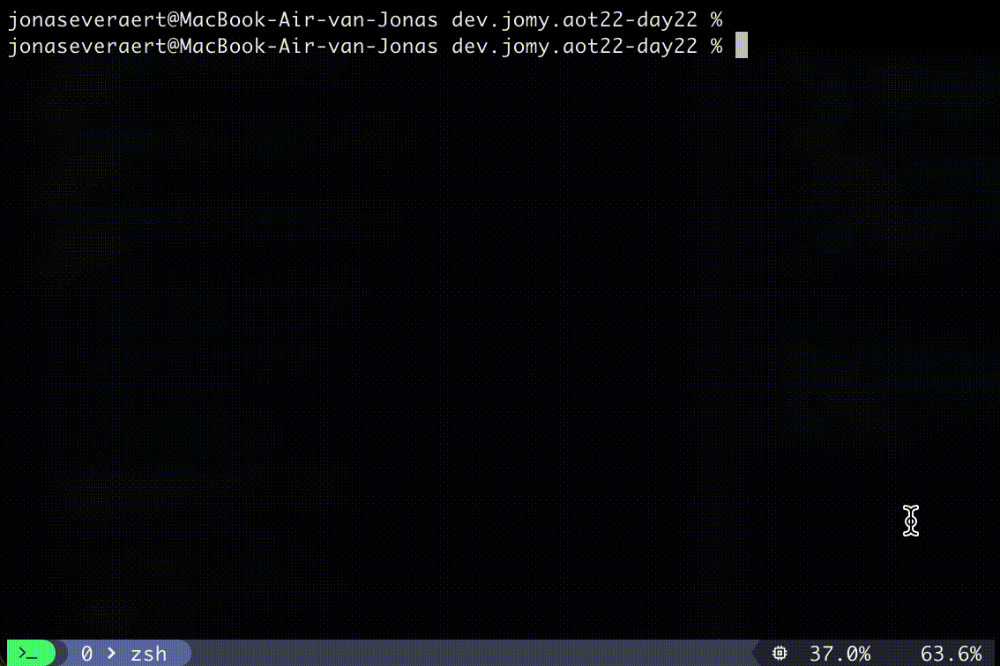

# Day 2

The randomizer has spoken. The most tedious language of the list is out of the way,
**Java**.

Say it with me:

```java
public class Main {
  public static void main(String[] arg) {
    System.out.println("Hello world");
  }
}
```

Today we cheated our way through rock, paper, scissors with OOP. I can
guarantee you that this day will have the most amount of source files.

I haven't written Java in about 2 years, and it shows in the amount of time
it took for this simple problem.

It took me a while to figure out how to compile Java from the command line.
Java is the only language on the list I don't know how to compile from the
command line. I decided to get this working without the help of IntelliJ.
You can watch me struggle below. This is excluding the many struggles
later on.


